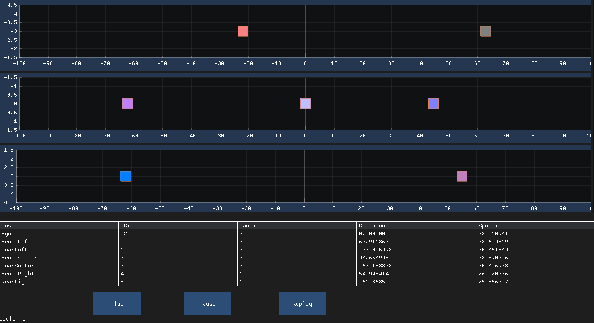
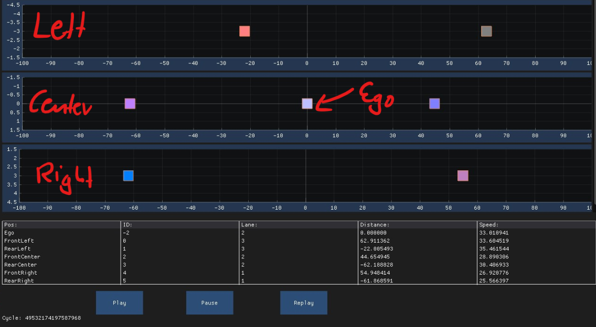

# Dear ImGUI Template to Start

## Example



## Exercise

The GUI should display the following features:

- For Left, Center, and Right Lane: Scatter Plot with ImPlot
  - Plot the position of the vehicles
  - Every vehicle should have a different color

```cpp
// Scatter Plot
if (ImPlot::BeginPlot("##Lane1", PLOT_DIM, PLOT_FLAGS))
    {
        ImPlot::SetupAxes(NULL, NULL, ImPlotAxisFlags_Lock, ImPlotAxisFlags_Lock | ImPlotAxisFlags_Invert);
        ImPlot::SetupAxisLimits(ImAxis_X1, -MAX_VIEW_RANGE_M, MAX_VIEW_RANGE_M, ImGuiCond_Always);
        ImPlot::SetupAxisLimits(ImAxis_Y1, LEFT_LEFT_BORDER, LEFT_RIGHT_BORDER, ImGuiCond_Always);
        ImPlot::SetNextMarkerStyle(...); // See documentation
        ImPlot::PlotScatter(...); // See documentation
        ...
    }
```

- Below the lanes plot, you should plot a table with all the vehicles data
- Below the table, you should plot the current cycle number and start/stop/replay buttons



## Modules

- GLFW
- GLAD
- ImGui
- ImPlot

## Software Dependencies

- OpenGL3 (should be already installed)
- CMake
- Unix: GCC, Clang
- Windows: MSVC x86 Compiler

### Installation

#### Windows

Cmake: <https://cmake.org/download/>  
MSVC Compiler: <https://visualstudio.microsoft.com/de/downloads/?q=build+tools>  

#### Linux

```bash
sudo apt-get install cmake
```

#### MacOS

```bash
brew install cmake
```

## Extra Settings

```json
  "clang-tidy.compilerArgsBefore": [
    "-Iexternal/imgui",
    "-D_CRT_SECURE_NO_WARNINGS"
  ],
  "clang-tidy.compilerArgs": [
    "-std=c++17"
  ]
```
