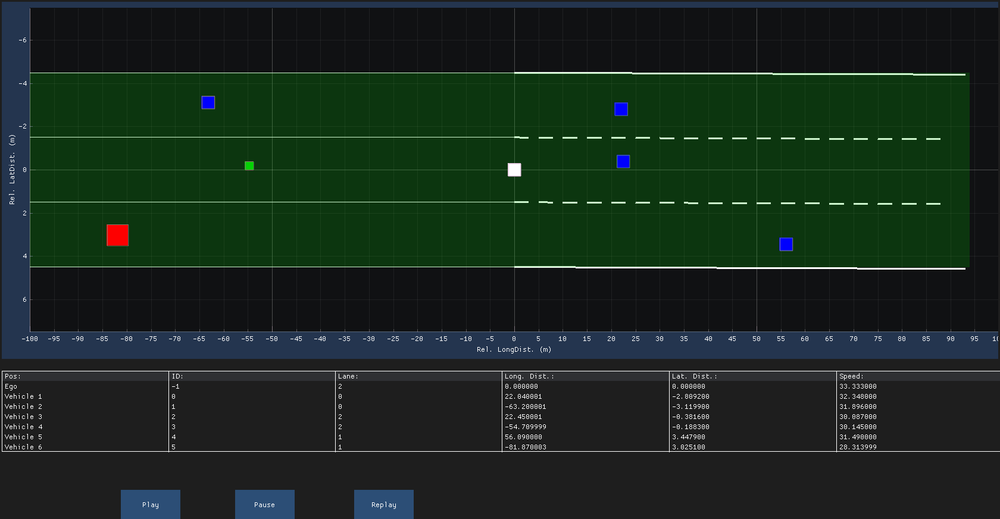

# Exercises

## Example



## Exercise

In this exercise, we will extend the vehicle and lane information.

### Exercise 1

Add a new enum class for the ObjectClassType with the following type:

- car
- truck
- motorbike
- none/unknown

Add a new enum class for the LaneClassType with the following type:

- normal
- acceleration
- deceleration
- hard-shoulder
- none/unknown

Extend the vehicle struct (from now on called *VehicleInformationType*):

```cpp
struct VehicleInformationType
{
    std::int32_t id;
    float width;
    float height;

    LaneAssociationType lane;
    ObjectClassType object_class;

    float speed_mps;
    float long_distance_m;
    float lat_distance_m;
};
```

Extend the lane struct:

```cpp
struct LaneInformationType
{
    Polynomial3rdDegreeType left_polynomial;
    Polynomial3rdDegreeType right_polynomial;

    LaneBoundaryType left_boundary_type;
    LaneBoundaryType right_boundary_type;

    float left_view_range_m;
    float right_view_range_m;

    float lane_width_m;
    LaneClassType lane_class;

    /**
     * @brief To compute the middle point of the two polynomials at pos. x
     */
    float get_lateral_position(const float x) const
    {
        if (x < 0.0F)
        {
            return (left_polynomial.d + right_polynomial.d) / 2.0F;
        }
        else
        {
            return (left_polynomial(x) + right_polynomial(x)) / 2.0F;
        }
    }
};
```

The DataLoader code is already updated for you.

### Exercise 2

Update the vehicle plotting code:

- Such that the following mapping is used:
  - Ego Vehicle:
    - White Square
    - Marker Size: 15.0
  - Other Car:
    - Blue Square
    - Marker Size: 15.0
  - Truck:
    - Red Square
    - Marker Size: 25.0
  - Motorbike:
    - Green Square
    - Marker Size: 10.0
- Such that the lateral and longitudinal distance is used
- Such that the lane class is used to color the lane (space between the lane borders)
  - Normal: Green-ish color
  - Acceleration: Blue-ish color
  - Deceleration: Blue-ish color
  - Hard-Shoulder: Red-ish color

Note: The colors are already defined in the RenderConstants.hpp

Hint:

Function for the lane class coloring is:

```cpp
ImPlot::SetNextFillStyle(color);
ImPlot::PlotShaded("###rear", xs_front_upper.data(), ys_front_upper.data(), num_front_points, offset_m);
```
